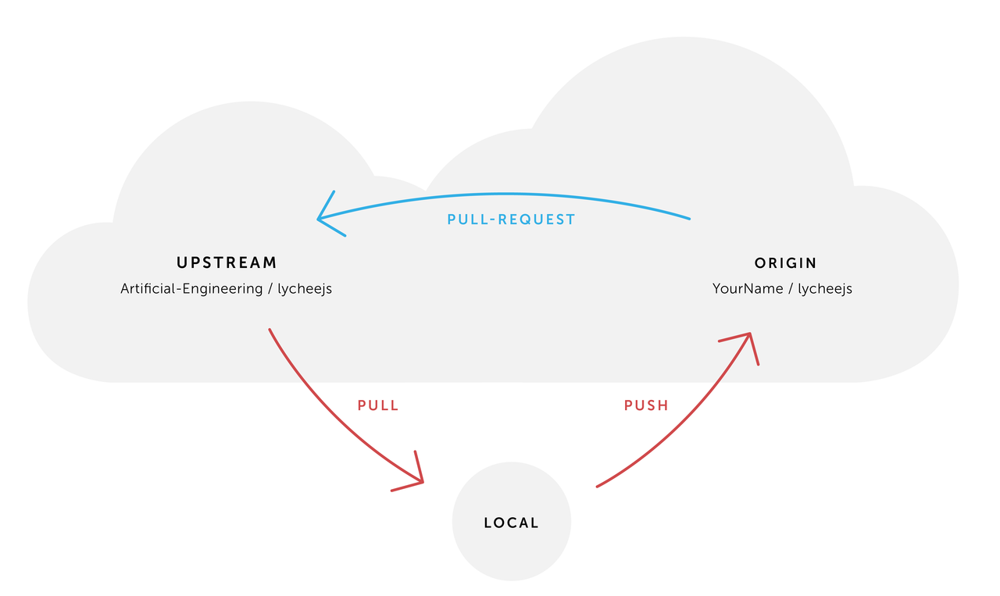
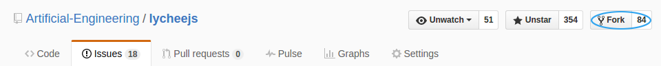
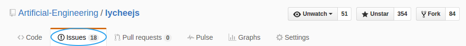

= Workflow

# Workflow

## Inhalt

- Terminologie
- Triangular Workflow
- Awesome GitHub
- Projekt Setup
- Live-Coding

## Requisiten

- GitHub Account
- github.com/INT-WAW ist GitHub Orga
- Texteditor ( Sublime Text, GitHub Atom, VIM )
- Git Bash - wichtig: BASH

## Requisiten

Es ist wirklich empfohlen, GNU/Linux
oder OSX mit brew zu verwenden. Ich
leiste keinen IT Support fuer
Windows-relevante Probleme. Sorry.


= Terminologie

# Terminologie

## Repository

- Verzeichnis fuer Datenspeicherung
- Typischerweise auf Servern (oder Peers)
- Versionsverwaltung
- Protokolle von Veraenderungen
- Konfliktaufloesung
- Metadaten fuer Paketmanager

## Clone

- Duplikat eines Repositories
- Backup-Aspekt
- Offline-Verfuegbarkeit
- Dezentrale Vorkommnis

## Beispiel

```bash
mkdir /opt/lycheejs;

git clone https://github.com/Artificial-Engineering/lycheejs.git /opt/lycheejs;
```

## Commit

- Veraenderung einer Datei
- Veraenderung zu einem Zeitpunkt
- Entfernen ( `-` ) oder Hinzufuegen ( `+` )
- Zeilenbasiert mit Textuellem Inhalt
- Dateibasiert mit Binaerem Inhalt

## Beispiel

```bash
cd /opt/lycheejs;

echo "Awesome Modification" > newfile.txt;
git add ./newfile.txt;
git commit -m "Awesome new commit";
```

## Revision

- Synonym fuer Version (Hash)
- Entwicklungsstadium der Software
- Einzelner Commit

## Tag

- Entwicklungszeitpunkt
- Version der Software
- Serie an Commits

## Beispiel

```bash
cd /opt/lycheejs;

echo "Awesome Modification" > newfile.txt;
git add ./newfile.txt;
git commit -m "Awesome new commit";

git tag v1.0 -m "Software is stable nao";
git push origin --tags;
```

## Branch

- master ist stable
- Variante der Software
- Feature (Serie an Commits)

## Beispiel

```bash
cd /opt/lycheejs;

git checkout development;
git checkout -b my-feature;

echo "awesome" > feature.txt;
git commit -m ":sparkles: Started work on my-feature";
```

## Fork

- Abzweigung des Projekts
- Fork ist neue Software
- Upstream ist alte Software
- Beispiel: LibreOffice ist Fork von OpenOffice
- Beispiel: LibreSSL ist Fork von OpenSSL
- Beispiel: Blink ist Fork von WebKit ist Fork von KHTML


= Triangularer Workflow

# Triangularer Workflow

## Uebersicht



## 1. Pull

- Pull von Upstream Repository
- Upstream Repository ist behind

## 2. Commit

- Lokaler Merge von Commits
- Lokale Feature Branches
- Lokale Commits sind ahead

## 3. Push

- Push zu eigenem Fork (Origin)
- Origin Repository ist ahead
- Keine Merge Conflicts

## 4. Pull Request

- Fork Maintainer initiiert Pull Request
- Upstream Maintainer merged Pull Request
- Keine Merge Conflicts
- Alle sind gluecklich
- Suck it, SVN und CVS


= Awesome GitHub

# Awesome GitHub

## Einfache Forks



## Einfache Pull Requests


## Einfache Issues (Bug Reports)



## Commits

- `Fixes issue #1337`
- `Solves #1337`
- `Closes issue #1337`
- `More work on issue #1337`

## Issues

- Probleme und Diskussionen
- Verlinkung von Contributors ( `@username` )
- Verlinkung von Commits ( `@hash` )
- Verlinkung von Issues ( `#issue` )
- Verlinking von Code Reviews
- Votes und Reactions

## Code Reviews

- Kommentare zu Commits
- Einbettung in Issues
- Einbettung in Wikis

## Wikis

- Markdown Syntax
- Einbettung in allen Dateien ( `.md` )
- Einbettung in Issues und Commits
- GitHub Code Editor

# Projekt Setup

## Project Setup

- Installiere git (git-bash)
- Forke die Boilerplate [1]
- Clone deinen Fork lokal
- Fuege Inhalt der HTML5 Datei hinzu
- Erstelle einen Feature Branch
- Habe Commits von ALLEN Teammitgliedern
- Erstelle einen Pull Request

[1] github.com/INT-WAW/Boilerplate.git

